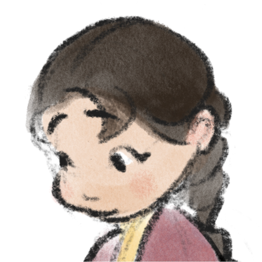
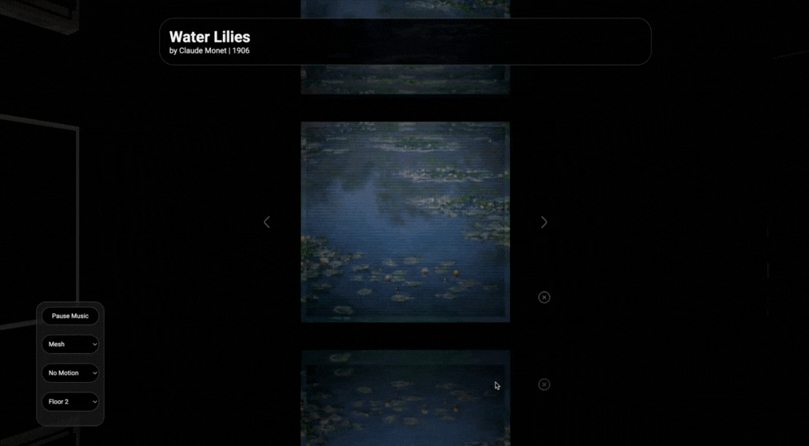
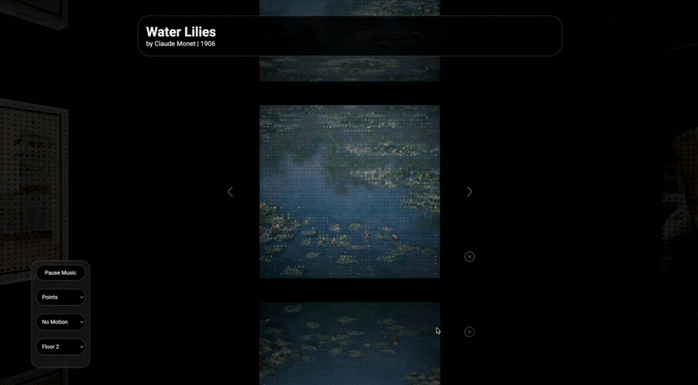

<h1>

Gallery
</h1>

A 3D gallery built with [three.js](https://threejs.org/) featuring customizable display modes.

- Menu allowing users to choose:
    - Mesh or point cloud rendering of artworks
    - Animation including flag-like waving and ripple motions
    - Different gallery floor levels
    - Toggling background music
- Navigation of gallery with arrows and artwork caption with question mark symbol, implemented using [three.js](https://threejs.org/) *RayCaster*
- Linear interpolation for smooth, gradual rotation of artworks
- Modified *MeshPhongMaterial* and *PointsMaterial* shaders for:
    - GPU-accelerated vertex position and color animations using sine waves
    - Including spot light calculations in *PointsMaterial*

## Preview

You can also try out the [interactive demo](https://ellyhpark.github.io/Gallery), as shown in the images above.

## Contributors
Thank you [sangkunine](https://github.com/sangkunine) for your mentorship.

Sound effect by <a href="https://pixabay.com/users/sergequadrado-24990007/?utm_source=link-attribution&utm_medium=referral&utm_campaign=music&utm_content=275487">Sergei Chetvertnykh</a> from <a href="https://pixabay.com/sound-effects//?utm_source=link-attribution&utm_medium=referral&utm_campaign=music&utm_content=275487">Pixabay</a>.

Arrow, question mark, and close symbols from Uicons by <a href="https://www.flaticon.com/uicons">Flaticon</a>.

Floor 2 artwork images and information from [Art Institute of Chicago](https://www.artic.edu/).